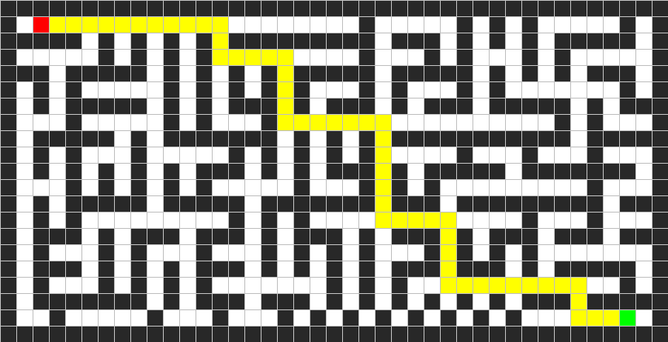

*أهلاً بك! هذا ملف `README.md` احترافي ومنظم لمشروعك، مصمم ليعكس كفاءة الخوارزميات التي قمت ببنائها وتوضيح هيكلية الكود.

---

# Maze Solver AI 🧩

مشروع جافا (Java) متطور لحل المتاهات باستخدام خوارزميات البحث في الذكاء الاصطناعي. يقوم البرنامج بقراءة المتاهة من ملف نصي، وإيجاد المسار الأمثل، ثم توليد صورة توضح الحل.

## ✨ الميزات

* **دعم خوارزميات متعددة:** يتضمن البحث الموجه وغير الموجه.
* **توليد صور:** يقوم بإنشاء ملف `maze_solution.png` لعرض المسار بصرياً.
* **هيكلية مرنة:** تصميم برمجي يعتمد على الكائنات (OOP) يسهل إضافة خوارزميات جديدة.

---

## 🛠 الخوارزميات المدعومة

تم تقسيم الخوارزميات إلى فئتين بناءً على استراتيجية البحث:

### 1. البحث غير الموجه (Uninformed Search)

* **BFS (Breadth-First Search):** يضمن إيجاد أقصر مسار في المتاهات غير الموزونة.
* **DFS (Depth-First Search):** يستكشف المسارات بعمق، مفيد للمتاهات المعقدة جداً.

### 2. البحث الموجه (Informed Search)

* **A* Search:** يستخدم التكلفة الفعلية والتقديرية (Heuristics) للوصول للهدف بكفاءة عالية.
* **Greedy Best-First Search:** يركز على الاقتراب من الهدف بأسرع شكل ممكن.

---

## 📁 هيكلية المشروع

```text
├── Project
│   ├── maze.txt              # ملف إدخال المتاهة
│   ├── maze_solution.png     # صورة الحل المستخرجة
│   ├── src/main/java/com/example
│   │   ├── Algorithm/        # منطق خوارزميات البحث
│   │   ├── maze/             # التعامل مع المتاهة وتوليد الصور
│   │   ├── Structure/        # هياكل البيانات (Stack, Queue, Heap)
│   │   └── Main.java         # نقطة انطلاق البرنامج

```

---

## 🚀 كيفية التشغيل

### المتطلبات

* **Java JDK 11** أو أحدث.
* **Maven** لإدارة الاعتمادات.

### الخطوات

1. قم بتجهيز ملف المتاهة `maze.txt`. مثال لشكل المتاهة:
```text
#########################################
# A                   #     # # #     # #
##### # # # # ######### ### # # # ##### #
#     # # # #         #   # #   # #     #
### ##### # # # # ##### ##### # # # ### #
# # #     # # # # #   # #   # #       # #
# # ##### # # ### # ### # ### ##### # ###
#   #     # #   #                 # #   #
# ##### # ####### # # # ########### #####
# # #   #     # # # # #     #   #   #   #
# # # # # # ### # # ### # ##### ####### #
#   # # # # #     #   # # #         #   #
# # ##### ##### ####### ### ######### ###
# # #         # # #             #   #   #
# ### # ### ### # ### # ### # ### ### ###
# #   # #   #   # # # #   # # # #       #
# ### # # # ### # # # # ### ### # ##### #
# #   # # # #       # # #             # #
# ####### # ### ### # # # # # # ### #####
#  #     #   #   # # # # # # # #      B #
#########################################
```


*(حيث A هي البداية و B هو الهدف).*
2. قم ببناء المشروع باستخدام Maven:
```bash
mvn clean install

```


3. قم بتشغيل الملف الرئيسي:
```bash
mvn exec:java -Dexec.mainClass="com.example.main.Main"

```


---

## 📊 هياكل البيانات المستخدمة

لتحقيق أقصى قدر من الكفاءة، تم بناء هياكل بيانات مخصصة لكل نوع من البحث:

* **StackFrontier:** للبحث عن طريق العمق (DFS).
* **QueueFrontier:** للبحث عن طريق العرض (BFS).
* **Heapq (Priority Queue):** لعمليات البحث الذكية (A* و Greedy).

---

## 📝 مثال على المخرجات

---
